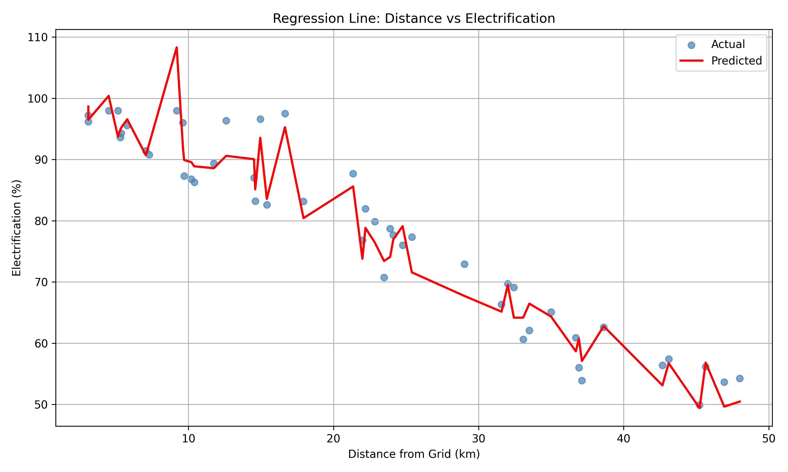
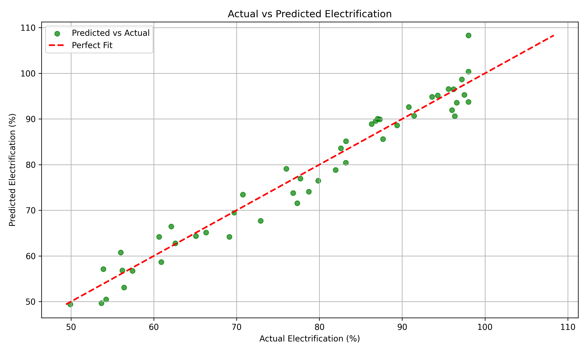

# Bangalore Rural Electrification Predictor

**Mini Project - SDG 9** | Predicting Rural Electrification using Data Analysis and Linear Regression

## Overview

This project aims to predict rural electrification percentages across villages in Bangalore using machine learning and statistical analysis. It addresses Sustainable Development Goal 9 (SDG 9) by leveraging data-driven insights to understand electrification patterns based on geographic and demographic factors.

## Dataset

- **Total Villages:** 238
- **Features:** Population, area (sq km), population density, distance from grid (km)
- **Target Variable:** Electrification percentage (%)~
- **Train/Test Split:** 190 training samples, 48 testing samples

## Key Findings

- Electrification generally declines as distance from the main grid increases
- Population density shows a mild positive relationship with electrification levels
- Non-linear patterns detected in the distance-electrification relationship



## Model Performance

| Metric | Value | Interpretation |
|--------|-------|-----------------|
| R² Score | 0.9532 | Model explains 95.32% of variance in electrification |
| MAE | 2.68% | Average prediction error of 2.68 percentage points |
| RMSE | 3.29% | Root mean squared error of 3.29 percentage points |



## Project Structure

```
├── main.py                 # Main pipeline execution
├── requirements.txt        # Python dependencies
├── Data/
│   └── data.csv           # Raw village electrification data
├── src/
│   ├── Data_Cleaning.py       # Data validation and cleaning
│   ├── Data_preprocessing.py  # Feature scaling and train-test split
│   ├── eda.py                 # Exploratory data analysis
│   ├── Model.py               # Linear regression training and evaluation
│   └── Visualization.py       # Result visualization and plotting
└── outputs/
    ├── actual_vs_predicted.png    # Prediction accuracy plot
    └── regression_result.png      # Distance vs electrification plot

```

## Installation

1. Clone the repository
2. Install dependencies:
   ```bash
   pip install -r requirements.txt
   ```

## Usage

Run the complete pipeline:
```bash
python main.py
```

This will execute all stages: data cleaning, EDA, preprocessing, model training, evaluation, and visualization.

## Technologies Used

- **Python 3.x**
- **pandas** - Data manipulation and analysis
- **scikit-learn** - Machine learning and preprocessing
- **matplotlib & seaborn** - Data visualization
- **numpy** - Numerical computations
